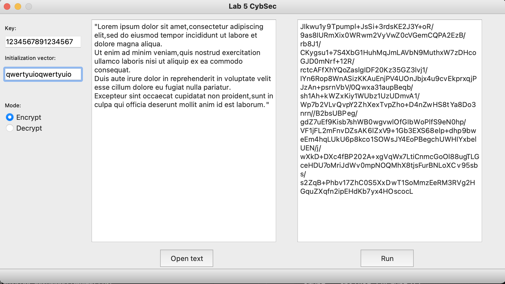
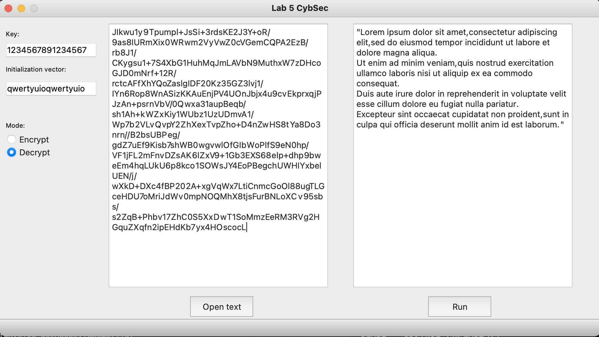
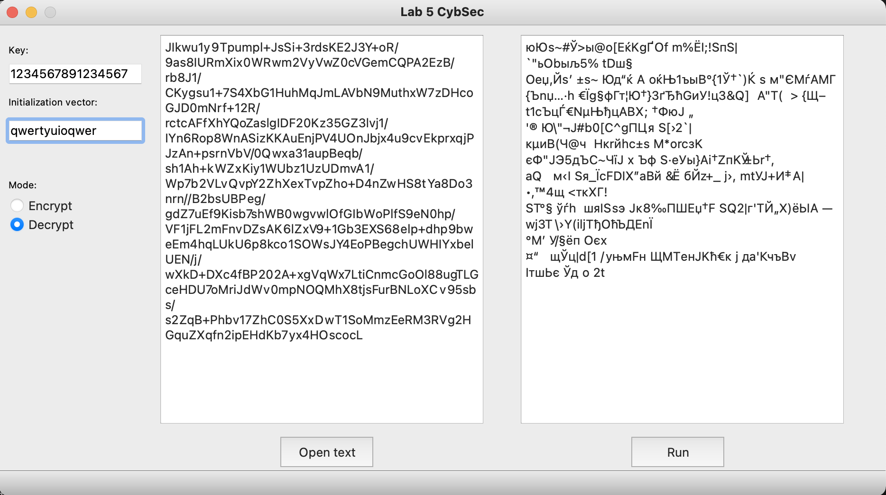
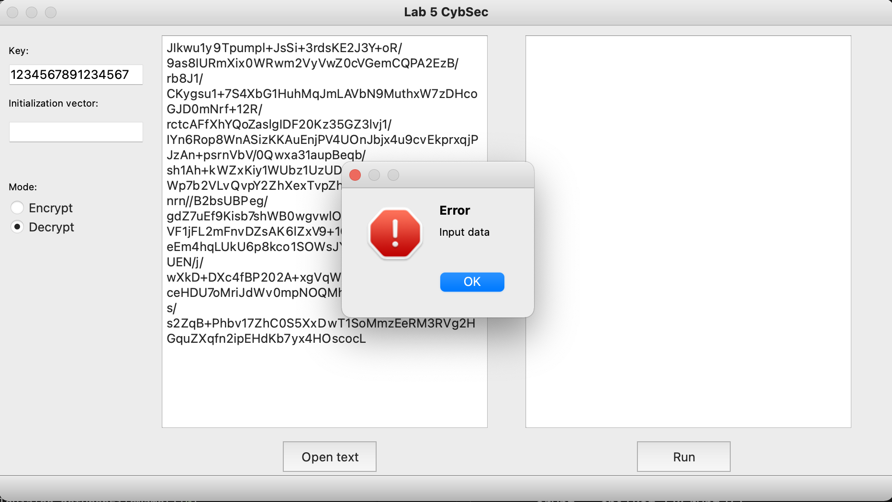

# Py_AES_256_CTR
Python GUI application (PyQt5) that encrypt &amp; decrypt AES-256-CTR using chilkat module (https://www.chilkatsoft.com/python.asp)


> #### Requirements: 
>
> - Python 3
> - PyQt5
> - Chilkat Module for Python (CkPython)
>
> https://www.chilkatsoft.com/python.asp 
> I used CkPython for MacOS and python 3.8: https://www.chilkatsoft.com/python.asp#macDownloads 




## Examples:

```python
import chilkat # import CkPython module

# Initializing a variables:
text = 'Test text for encryption'
key = 'somekeyforencode'
iv = 'itsinitialvector'
```
### Encrypt:
```python
crypt = chilkat.CkCrypt2()
crypt.put_CryptAlgorithm("aes")
crypt.put_CipherMode("ctr")
crypt.put_KeyLength(256)
crypt.put_EncodingMode("base64")
crypt.SetEncodedIV(iv,"ascii")
crypt.SetEncodedKey(key,"ascii")
encStr = crypt.encryptStringENC(text)
# 82LV6kHAxMT/3KOS4uJGYIC57XHrO/G1
```
### Decrypt:
```python
decrypt = chilkat.CkCrypt2()
decrypt.put_CryptAlgorithm("aes")
decrypt.put_CipherMode("ctr")
decrypt.put_KeyLength(256)
decrypt.put_EncodingMode("base64")
decrypt.SetEncodedIV(iv,"ascii")
decrypt.SetEncodedKey(key,"ascii")
decStr = decrypt.decryptStringENC(text)
# Test text for encryption
```

